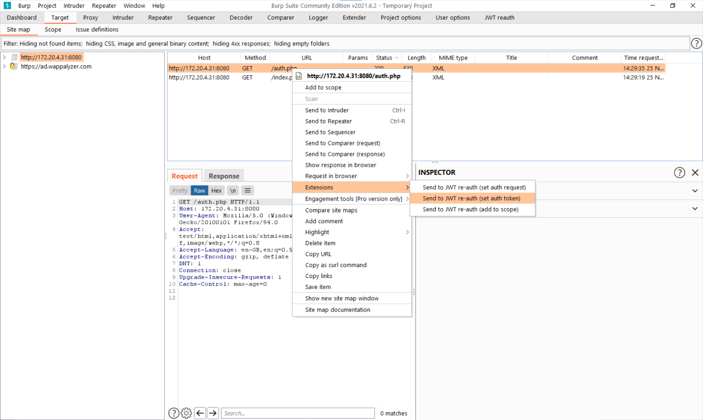
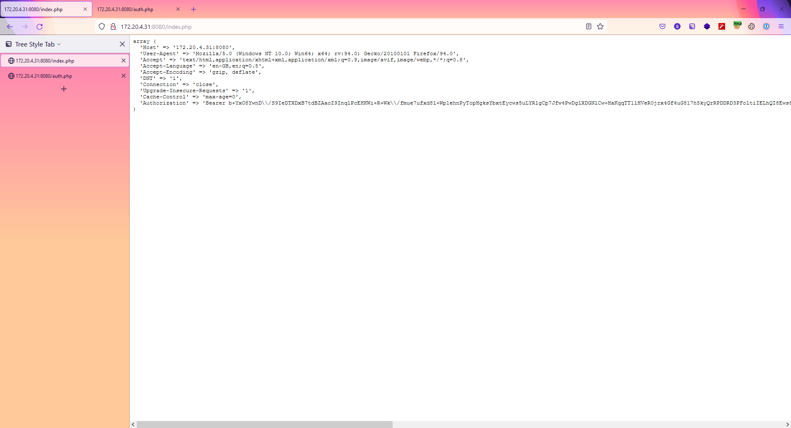

# JWT Re-auth

Burp plugin to cache authentication tokens from an "auth" URL, and then add them as headers on all requests going to a certain scope.

## Features

The plugin allows settings to be sent to it via context menus from various menus.
This includes using an entire captured request to acquire new authentication tokens.

All of the settings for the plugin can be controller from the main UI panel:

There is a seperate UI panel to show the scope:

Finally we can see the plugin attaching a cached authentication token as a header.

